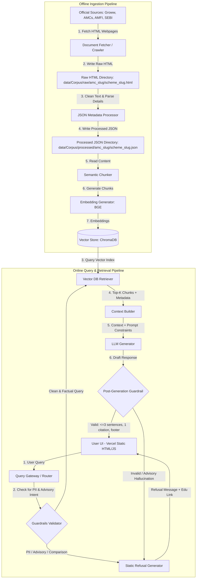

# RAG Chatbot Architecture: Mutual Fund FAQ Assistant (Dynamic & Multi-AMC)

This document details the system architecture, component design, data flow, and guardrails for the **Mutual Fund FAQ Assistant**. The architecture is optimized for scalability across multiple Asset Management Companies (AMCs), factual accuracy, strict compliance (no investment advice, no PII), and source verification.

---

## 1. High-Level System Architecture

The system consists of two primary pipelines:
1. **Offline Ingestion Pipeline**: Decouples crawling (Raw HTML) from metadata cleaning (Processed JSON) to ensure robust, reproducible parsing before chunking, embedding, and indexing into the Vector DB. It scales dynamically to support multiple AMCs.
2. **Online Query & Retrieval Pipeline**: Handles user queries, applies guardrails (advisory/PII filters), retrieves relevant context, generates a constrained response, and validates constraints before showing the answer to the user.



---

## 2. Component Design & Technical Specifications

### A. Offline Ingestion Pipeline

The offline ingestion pipeline is split into modular components for clarity and maintenance:

1. **Crawler & Fetcher (`src/ingestion/fetcher.py`)**:
   - **Inputs**: URLs dynamically loaded from `config/schemes.json`.
   - **Outputs**: Crawls webpages and saves raw HTML files to `data/Corpus/raw/{amc_slug}/{scheme_slug}.html`.

2. **BS4 & Regex Metadata Detail Parser (`src/ingestion/parser.py`)**:
   - Parses crawled raw HTML.
   - **Detail Extraction**: Dynamically extracts critical parameters (NAV, AUM, Expense Ratio, Min SIP, Exit Load, and Fund Managers) from the text.
   - **Offline Resiliency**: If crawling fails, the fetcher returns False and the pipeline skips indexing for that scheme rather than generating placeholder files.
   - **Outputs**: Writes clean structured JSON documents to `data/Corpus/processed/{amc_slug}/{scheme_slug}.json`.

3. **Semantic/Logical Chunker (`src/ingestion/chunker.py`)**:
   - Reads processed JSON files.
   - **Preamble Injection**: Builds a factual preamble paragraph summarizing NAV, AUM, Min SIP, managers, and exit load.
   - **Outputs**: Generates ~400-char logical chunks with inherited metadata (`source_url`, `scheme_name`, `amc_name`, `doc_type`, `last_updated_date`).

4. **Vector database Indexer (`src/ingestion/indexer.py`)**:
   - **Embedding Model**: `BAAI/bge-small-en-v1.5` via `SentenceTransformer`.
   - **Outputs**: Connects to `ChromaDB`, clears the old index to prevent duplicates, generates BGE embeddings, and indexes chunks.

5. **Coordination Runner (`src/ingestion/ingestion.py`)**:
   - Orchestrates the fetch, parse, chunk, and index stages.
   - **Cleanup**: Clears any legacy root outputs directly under `data/Corpus/raw/` and `data/Corpus/processed/` before execution.

3. **Semantic / Section-Based Chunker**:
   - Regular chunking by token count can break apart tables, exit loads, or expense ratios, causing retrieval errors.
   - **Strategy**: Section-based chunking combined with overlap (e.g., 500-token chunks with 100-token overlap). Tables (like exit loads) are parsed into structural text or markdown tables to preserve relationships.

4. **Embedding Generator & Vector Store**:
   - **Embedding Model**: `BAAI/bge-small-en-v1.5` (via `sentence-transformers` library, a highly optimized model for local text embeddings).
   - **Vector Store**: `Chroma` or `FAISS`. Chroma is preferred as it is serverless, lightweight, and supports metadata filtering natively.

5. **Scheduler Component (GitHub Actions)**:
   - **Trigger**: Automated cron job running daily Monday through Friday (excluding Saturday and Sunday) at 9:20 AM IST (3:50 AM UTC).
   - **Cron Expression**: `50 3 * * 1-5`
   - **Workflow File**: `.github/workflows/daily_ingestion.yml`
   - **Responsibility**: Checks out code, sets up Python, runs `src/ingestion/ingestion.py` to crawl fresh data, re-builds ChromaDB index, and commits the updated vector database files back to the repository.

---

## 3. Data Schema (Vector Store Metadata)

Each vector document payload contains:
```json
{
  "id": "chunk_uuid",
  "text": "The exit load for HDFC Mid-Cap Fund is 1.00% if redeemed within 1 year from allotment...",
  "metadata": {
    "source_url": "https://groww.in/mutual-funds/hdfc-mid-cap-fund-direct-growth",
    "scheme_name": "HDFC Mid-Cap Fund",
    "category": "Mid Cap",
    "doc_type": "webpage",
    "last_updated_date": "2026-06-19"
  }
}
```

---

## 4. Online Query & Retrieval Pipeline (Detailed Steps)

### Step 1: Query Gateway & Pre-Retrieval Guardrails
Before querying the Vector Database, the system routes the user input through a validator:
- **PII Detector**: Uses regular expressions and simple entity checks to block any inputs containing PAN card numbers, Aadhaar, account numbers, phone numbers, or OTPs.
- **Intent Classifier**: A lightweight prompt or rule-based routing to check if the user is asking for:
  - **Advisory**: *"Which fund should I buy?"*, *"Is HDFC Mid-Cap better than HDFC Large-Cap?"*
  - **Performance/Returns comparison**: *"Did HDFC Mid-Cap perform better than HDFC Small-Cap?"*
- **Output**: If flagged, it bypasses retrieval and generates an instant refusal (see Section 5).

### Step 2: Context Retrieval
If the query passes the gateway:
- The system embeds the query and retrieves the Top-K chunks ($K \approx 3$ to $5$) from the Vector Store.
- Metadata filters can be dynamically applied if the query mentions a specific scheme (e.g., filtering strictly by `scheme_name = 'HDFC Mid-Cap Fund'`).

### Step 3: Prompt Construction & LLM Constraints
The prompt enforces strict behavior constraints on the LLM:

```text
System Prompt:
You are a facts-only Mutual Fund FAQ Assistant. Your objective is to answer user queries using ONLY the provided contexts.

Constraints:
1. Limit your answer to a maximum of 3 sentences.
2. Answer using objective, verifiable facts. Do not provide opinions, advice, or suggestions.
3. If the query asks for performance returns, do not calculate or compare. Simply provide the link to the official factsheet.
4. If the answer cannot be found in the context, politely state that you do not have the official facts to answer.
5. You must choose the single most relevant source URL from the context and cite it exactly.

Context:
{context}

Query:
{query}

Format your output exactly as follows:
Answer: <factual answer in 1-3 sentences>
Source: <single source_url>
```

### Step 4: Post-Retrieval Guardrail & Output Formatter
A post-processing module parses the raw LLM output:
1. **Sentence Counter**: Verifies that the answer is $\le 3$ sentences.
2. **Citation Extractor**: Checks that exactly one URL is returned and that it matches one of the URLs present in the retrieved context metadata.
3. **Footer Appender**: Appends the mandatory footer:
   `Last updated from sources: <date>` (derived from the retrieved metadata).
4. **Refusal Check**: If the LLM generates a refusal message or flags its own lack of context, the system serves the standard polite refusal template.

---

## 5. Refusal & Fallback System

For queries that require refusal (advisory, lack of information, or PII block), the system responds with a structured refusal:

| Trigger Type | Refusal Message | Educational Footer / Link |
| :--- | :--- | :--- |
| **Advisory / Opinion** | *"I can only provide factual, objective details about mutual fund schemes. I cannot provide investment advice or recommendations."* | Learn more about investing responsibly: [AMFI Investor Education Portal](https://www.amfiindia.com/investor-corner) |
| **PII Detected** | *"For security and privacy, please do not share personal information like PAN, Aadhaar, account numbers, or OTPs."* | For account inquiries, please log in directly to your AMC portal. |
| **Out of Context** | *"I do not have access to official documents containing that information. I can only answer questions using our verified corpus."* | Verify official guidelines at: [SEBI Resources](https://www.sebi.gov.in/) |

---

## 6. Technology Stack Recommendations

- **Frontend UI**: **Static Web Application** (HTML/CSS/JS) deployed on Vercel. Ideal for a high-performance responsive chatbot interface with disclaimers, welcome messages, and quick-start example questions.
- **Backend Framework**: **FastAPI** (Python) deployed on Railway. Exposes REST endpoints, runs guardrails, and manages ChromaDB queries.
- **Orchestration**: **LangChain** or **LlamaIndex** for managing the vector store connections, retrieval chain, and prompt routing.
- **Vector Database**: **ChromaDB** (embedded vector store) to avoid external database setup overhead.
- **LLM**: **GROQ** (using `llama-3.1-8b-instant` or `mixtral-8x7b-32768` via Groq API) due to its extremely low latency, cost-efficiency, and strong instruction-following capabilities.

---

## 7. Minimal User Interface Layout

The Web UI will display:
1. **Header**: "Mutual Fund Facts-Only FAQ Assistant"
2. **Disclaimer Notice** (Sidebar/Banner): *“This tool is facts-only and retrieves information from official AMC/SEBI/AMFI documents. It does not provide investment advice or comparisons.”*
3. **Sample Queries**: Clickable buttons for:
   - *"What is the exit load for HDFC Mid-Cap Fund?"*
   - *"What is the expense ratio of HDFC Large-Cap Fund?"*
   - *"What is the benchmark of HDFC Small-Cap Fund?"*
4. **Chat Window**: Interactive chat interface displaying response bubbles, single source link citations, and the `Last updated from sources: <date>` footer.
